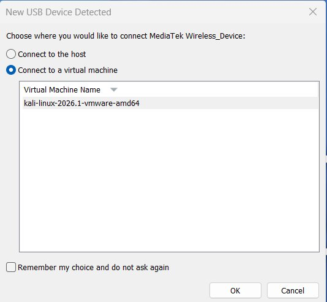
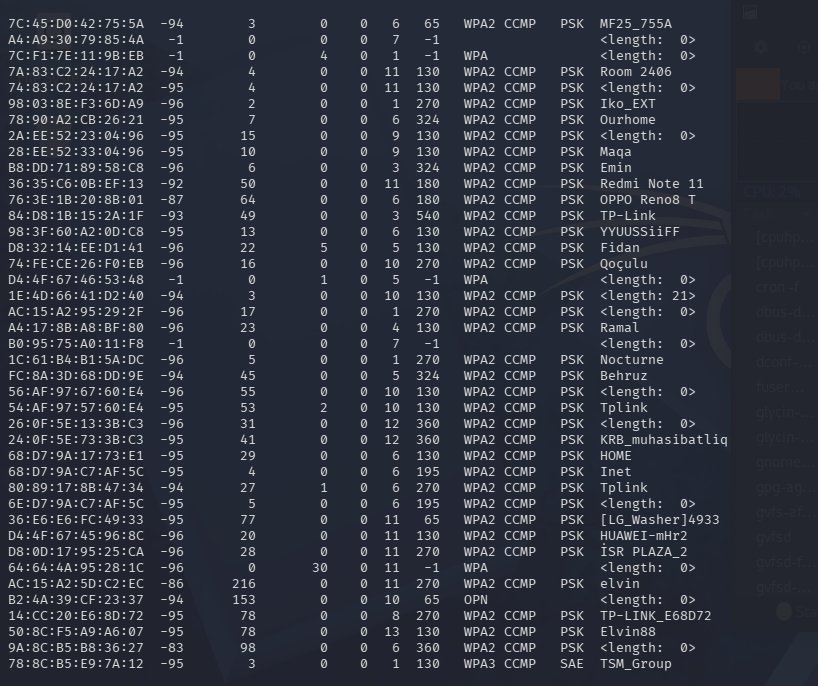
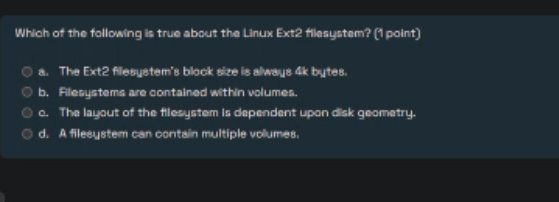
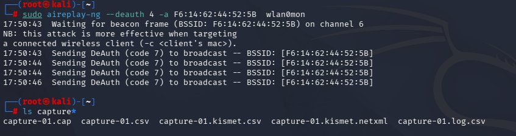
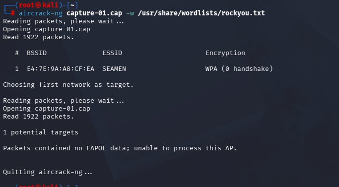
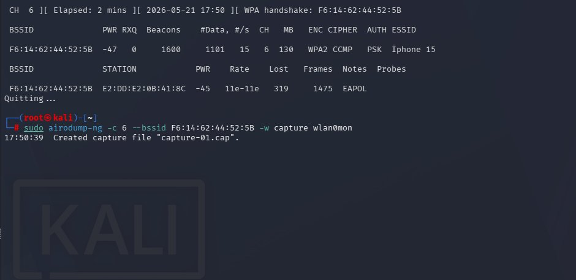
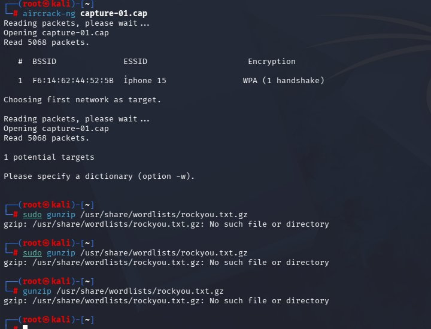
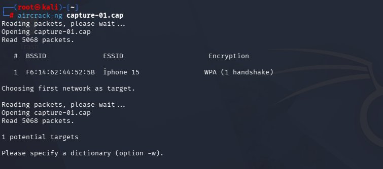
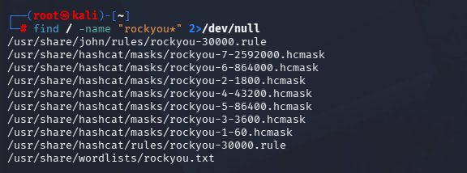

# WPA2 Handshake Capture & Password Cracking Lab

**Educational Purpose Only. This lab was performed on a personally owned hotspot for the purpose of learning wireless security concepts.**

A hands-on wireless security lab that demonstrates the full WPA2 4-way handshake capture process on a personal hotspot, followed by an offline dictionary attack using `aircrack-ng`. The goal is to understand how the attack works end to end so it can be defended against.

## 📌 Overview

This lab walks through the complete WPA2 attack chain, in order:

1. Passes a USB Wi-Fi adapter into a **Kali Linux** virtual machine
2. Enables **monitor mode** on the adapter
3. Scans the surrounding airspace with **airodump-ng** to discover access points
4. Locks onto a single owned target (an **iPhone 15** personal hotspot) and starts a focused capture
5. Forces a reconnection with an **aireplay-ng** deauthentication burst to capture the 4-way handshake
6. Verifies that a valid EAPOL handshake was captured
7. Runs an offline **dictionary attack** with `aircrack-ng` against `rockyou.txt` to recover the passphrase

The lab also demonstrates a common failure case (a capture with no EAPOL data) and a real wordlist troubleshooting step, so the writeup reflects what actually happens rather than a perfect run.

The exercise reinforces three core ideas:

- How WPA2 authentication works
- Why weak passwords are a critical vulnerability
- How attackers exploit offline cracking after only minimal on-site exposure

---

# ⚖️ Legal Disclaimer

⚠️ All tests were performed exclusively on a personally owned Wi-Fi hotspot.

Capturing handshakes or attempting to crack passwords on networks you do not own is illegal under computer fraud laws in most countries. This project is strictly for educational and academic purposes. Do not use these techniques against any network without explicit written authorization.

---

# 🛠️ Tools Used

| Tool | Purpose |
| --- | --- |
| **Kali Linux** | Penetration testing OS |
| **airmon-ng** | Enable/disable monitor mode on the wireless adapter |
| **airodump-ng** | Capture wireless packets and handshakes |
| **aireplay-ng** | Send deauthentication frames to force reconnection |
| **aircrack-ng** | Dictionary-based WPA2 password cracking |
| **hashcat** (optional) | GPU-accelerated password cracking |
| **hcxpcapngtool** (optional) | Convert `.cap` to a hashcat-compatible format |
| **rockyou.txt** | Common password wordlist (14+ million entries) |

---

# 💻 Environment Setup

- **OS:** Kali Linux (latest rolling release)
- **Target:** Personal iPhone 15 hotspot (owned device)
- **Wireless Adapter:** Monitor-mode capable USB adapter
- **Network:** Isolated personal hotspot, no third-party networks involved

---

# 📡 Lab Walkthrough

## 1. Pass the Wi-Fi adapter into the Kali VM

The wireless attack requires direct hardware access to a monitor-mode capable adapter. Because Kali is running inside VMware, the USB Wi-Fi adapter is passed through from the host to the virtual machine rather than connecting it to the host OS.



After passthrough, the adapter is enabled in monitor mode (which exposes the `wlan0mon` interface used in the following steps):

```bash
sudo airmon-ng start wlan0
```

## 2. Scan the airspace with airodump-ng

With the interface in monitor mode, `airodump-ng` lists every nearby access point along with its BSSID, signal strength, channel, encryption type, and ESSID. This is the reconnaissance phase used to confirm the target network and note its BSSID and channel.

```bash
sudo airodump-ng wlan0mon
```



> Almost every network here is `WPA2 CCMP PSK`. The pre-shared key model is exactly what makes an offline dictionary attack possible once a handshake is captured.

## 3. Lock onto the target and start a focused capture

Once the target hotspot is identified, the capture is narrowed to a single BSSID and channel. This filters out all unrelated traffic and writes a clean capture file. The target here is the owned **iPhone 15** hotspot on channel 6.

```bash
sudo airodump-ng -c 6 --bssid F6:14:62:44:52:5B -w capture wlan0mon
```



The top-right status line confirms the goal of this step: `WPA handshake: F6:14:62:44:52:5B`. A client station was associated, which is what allows the handshake to be captured.

## 4. Force a reconnection with a deauth burst

To capture the 4-way handshake without waiting for a device to join naturally, a short deauthentication burst is sent. The connected client briefly drops and automatically reconnects, and that reconnection produces the handshake.

```bash
sudo aireplay-ng --deauth 4 -a F6:14:62:44:52:5B wlan0mon
```



After the deauth, `ls capture*` shows the generated capture set, including `capture-01.cap`, which holds the handshake.

## 5. The failure case: a capture with no EAPOL data

Not every capture succeeds. An earlier attempt against a different network produced a `.cap` file with **0 handshakes**, and `aircrack-ng` reported that the file contained no EAPOL data. This is the most common reason a WPA2 crack cannot even begin: without the EAPOL handshake frames, there is nothing to attack.



This is included on purpose. The takeaway is that the deauth-and-recapture step matters, and you must verify the handshake before wasting time on cracking.

## 6. Verify the captured handshake

Running `aircrack-ng` against the good capture confirms a valid handshake is present. The target shows `WPA (1 handshake)`, and the tool simply asks for a dictionary, which means the capture is ready to crack.

```bash
aircrack-ng capture-01.cap
```



## 7. Wordlist troubleshooting

A small but realistic snag. The standard `rockyou.txt.gz` was not present at the expected path, so the `gunzip` attempts failed. On this Kali build the wordlist already exists decompressed.



Locating the wordlist confirms it is already available as a plain `.txt` file:

```bash
find / -name "rockyou*" 2>/dev/null
```



The wordlist is at `/usr/share/wordlists/rockyou.txt`, so no decompression is needed.

## 8. Run the offline dictionary attack

With a verified handshake and a wordlist in hand, `aircrack-ng` runs the offline attack. Each candidate password from the wordlist is tested against the captured handshake until a match is found.

```bash
aircrack-ng capture-01.cap -w /usr/share/wordlists/rockyou.txt
```



```
KEY FOUND! [ 987654321 ]
```

The passphrase was a weak, all-numeric password, so it was recovered almost immediately. This is the entire point of the lab: a captured handshake plus a weak password equals a near-instant compromise, entirely offline and out of sight of the target.

---

# 🔑 Key Result

A valid WPA2 handshake was captured from an owned hotspot and the passphrase was recovered offline with a standard wordlist. The deciding factor was password strength, not the strength of WPA2 itself. The protocol did its job; the weak passphrase did not.

---

# 🛡️ Defensive Takeaways

The reason this attack works is almost always a weak pre-shared key. To defend a real network against exactly this chain:

1. **Use a long, high-entropy passphrase.** A random 16+ character passphrase is not present in `rockyou.txt` and is impractical to brute force. Avoid numeric-only and dictionary passwords.
2. **Prefer WPA3 where supported.** WPA3-SAE (Simultaneous Authentication of Equals) is resistant to offline dictionary attacks even if the exchange is captured.
3. **Enable Protected Management Frames (PMF / 802.11w).** PMF makes the deauthentication step far harder, which disrupts the handshake-capture phase.
4. **Reduce signal exposure.** Lower transmit power and good placement shrink the area where an attacker can passively capture frames.
5. **Monitor for deauth floods.** A sudden burst of deauthentication frames is a strong indicator that someone is attempting a handshake capture, and it is detectable from the defensive side.

---

# 📂 Repository Structure

```
.
├── README.md
├── WiFi Adapter Setup (Alfa AWUS036ACH + VMware).md
└── images/
    ├── 01-vmware-usb-adapter-passthrough.png
    ├── 02-airodump-network-scan.png
    ├── 03-airodump-targeted-capture-handshake.png
    ├── 04-aireplay-deauth-attack.png
    ├── 05-no-eapol-failed-capture.png
    ├── 06-handshake-verified.png
    ├── 07-wordlist-troubleshooting.png
    ├── 08-locate-rockyou-wordlist.png
    └── 09-key-found.png
```
